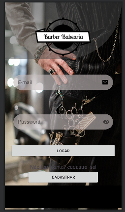

# App

Este é o repositório do aplicativo da Barbearia, desenvolvido no Android Studio, que permite aos clientes agendar horários para cortes de cabelo e barba.


## Tecnologias Utilizadas

- Kotlin
- Android Studio 


## Funcionalidades

Tela de Login: Os usuários podem fazer login com suas credenciais ou criar uma nova conta.
Tela de Cadastro: Novos clientes podem se cadastrar fornecendo informações básicas.
Tela Principal: Exibe os serviços oferecidos pela barbearia e informações sobre o estabelecimento.
Tela de Agendamento: Permite que os clientes selecionem um serviço e escolham uma data e hora disponíveis para agendamento.
Tela de Confirmação: Confirma os detalhes do agendamento antes de ser finalizado.
Tela de Histórico: Mostra o histórico de agendamentos anteriores do cliente.
Notificações: Lembretes de agendamentos são enviados para os clientes antes da data marcada.

## Requisitos do Sistema

Dispositivo ou emulador Android com versão 2022.2.1 Patch 2  ou superior.
Conexão com a internet para autenticação e atualização de horários disponíveis.

## Instalação

1. Clone este repositório.

```bash
git clone https://github.com/seu-usuario/seu-projeto.git

```
---

