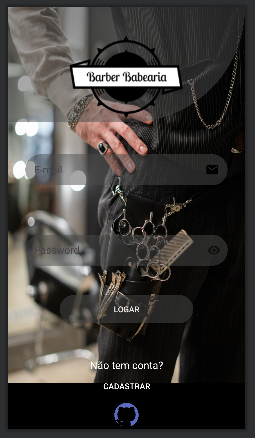

# App

Este é o repositório do aplicativo da Barbearia, desenvolvido no Android Studio, que permite aos clientes agendar horários para cortes de cabelo e barba.

## Tecnologias Utilizadas

- Kotlin
- Android Studio 
- Flask - servidor

## Funcionalidades

Tela de Login: Os usuários podem fazer login com suas credenciais ou criar uma nova conta.
___

___
Tela de Cadastro: Novos clientes podem se cadastrar fornecendo informações básicas.
___

___
Tela Principal: Exibe os serviços oferecidos pela barbearia e informações sobre o estabelecimento.
___

___
Tela de Agendamento: Permite que os clientes selecionem um serviço e escolham uma data e hora disponíveis para agendamento.
Tela de Confirmação: Confirma os detalhes do agendamento antes de ser finalizado.
Tela de Histórico: Mostra o histórico de agendamentos anteriores do cliente.
Notificações: Lembretes de agendamentos são enviados para os clientes antes da data marcada.

## Requisitos do Sistema

Dispositivo ou emulador Android com versão Lollipop 5.0 ou superior.
Conexão com a internet para autenticação e atualização de horários disponíveis.

## Instalação

<a href="/download-apk/app-Barber-TESTE.apk" download>Clique aqui </a>

Os dispositivos Android geralmente impedem a instalação de apps de desenvolvedores desconhecidos — isto é, que não sejam da Google Play Store. É possível mudar isso, claro, ativando a opção fontes desconhecidas nas configurações do smartphone. No entanto, o processo ficou um pouco mais complicado a partir do Android Oreo 8.0.

## Fontes desconhecidas

“Para instalar aplicativos de lojas que não estejam pré-instaladas no seu dispositivo, o Android solicita que você habilite a configuração de Fontes desconhecidas. Isso permite que você faça o download de aplicativos e jogos para o seu dispositivo móvel a partir de outras fontes que não sejam o Google.

Quando estiver usando a internet, você deve tomar o cuidado de baixar conteúdo somente de fontes em que você confia (como a Amazon). A Amazon somente faz o download de aplicativos e jogos que você tenha adquirido de forma intencional para o seu dispositivo, “, nota da Amazon App Store.

Suponha que você abriu o Google Chrome e clicou em baixar o app da Amazon Appstore. Para usá-la no Android 8.0 Oreo, é preciso autorizar o Chrome a instalar apps de fontes desconhecidas. Depois, você precisa dar autorização para a Amazon Appstore se quiser instalar apps a partir dela. É uma medida de segurança, mas de baixo efeito.

## Como instalar apps de fontes desconhecidas no Android

    Acesse as Configurações;
    Aplicativos e notificações e procure Avançado;
    Em Acesso especial de apps, toque em Instalar apps desconhecidos.

É possível que, em alguns Androids, o caminho seja um pouco diferente.

    Acesse as Configurações;
    Depois Configurações adicionais;
    Em Instalar aplicativos de fontes externas, dê autorização a Amazon ou Chrome.

## Procedimento universal

Durante o processo de instalação, siga as instruções na tela do Android.

    Para acessar a configuração de Fontes desconhecidas, vá em Configurações;
    Selecione Segurança (Android OS 4.0+)
    ou Aplicativos(Android OS 3.0 e versões anteriores)
    Role até a parte inferior da tela para ver as configurações de Fontes desconhecidas.
    Para Android 8.0 +, toque em Configurações e depois em Aplicativos;
    Em seguida, selecione “Amazon Appstore” (ou outro app);
    Toque em Install unknown apps (Instalar aplicativos desconhecidos);
    Depois, ative “Allow from this source” (Permitir a partir desta fonte).

O Google diz que isso torna o Android mais seguro. Por exemplo, se um jogo notificar o usuário para instalar um código malicioso — disfarçado como uma atualização de segurança — o Android vai avisar que ele não tem permissão para fazer isso.